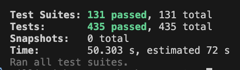
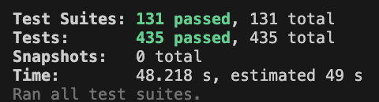

A little while ago I upgraded React to v19 in [OMA3](https://github.com/HeyOmae/OMA3) and I started to see this warning pop up in my terminal when I ran my tests.


Like any developer, I completely ignored it, knowing that warning are more like suggestions than like mandates. But it still annoyed me to see that pop up in every test. So I decided that I was going to solve it. And so I wasted about a week to track down what the problem was.

I originally just stumbled around trying to understand what was going on. I of course started with the official docs, as they published [an upgrade guide](https://react.dev/blog/2024/04/25/react-19-upgrade-guide). And there it was as plain as day in the [Installing section](https://react.dev/blog/2024/04/25/react-19-upgrade-guide#installing).

> New JSX Transform is now required

Anyway, [the announcement doc from 2020](https://legacy.reactjs.org/blog/2020/09/22/introducing-the-new-jsx-transform.html) was not helpful in debugging the problem as they said [NextJS over 9.5.3](https://legacy.reactjs.org/blog/2020/09/22/introducing-the-new-jsx-transform.html#nextjs) should support this. And OMA3 is currently on 15.2.0.

I double checked the .babelrc, and my jest config. And they appeared to be correct.

I tried to Google for the answers but oddly didn't see anyone else with this problem (at least in their test files only). I asked Gemini and ChatGPT, and they gave me incredibly misleading hints that did nothing.

Anyway, ChatGPT did give me one hint that was a helpful clue to debug the situation.

It told me to run 

```
BABEL_SHOW_CONFIG_FOR=./path/to/someJSfile.js jest --clearCache
```

I modified it a bit to look like this.

```
BABEL_SHOW_CONFIG_FOR=./components/runner/CharacterSheet/CharacterSheet.test.tsx npm run test
```

Which ended up running ALL of my tests, but did print out the babel config. Which did not help me. Everything looked like it was configured correctly. But I did see this

```
  "presets": [
    "next/babel",
    "node_modules/babel-preset-jest/index.js"
  ]
```

What if the problem was in babel-preset-jest? It wasn't...I'll cut to the chase, the problem was in `next/babel`.

You can see [here](https://github.com/vercel/next.js/blob/canary/packages/next/src/build/babel/preset.ts#L86C1-L89C54)

```
  const useJsxRuntime =
    options['preset-react']?.runtime === 'automatic' ||
    (Boolean(api.caller((caller: any) => !!caller && caller.hasJsxRuntime)) &&
      options['preset-react']?.runtime !== 'classic')
```

This controls if the new JSX transform is used. And in `babel-jest` the runtime isn't set and the `hasJsxRuntime` is also not set. So the JSX transform falls back to classic.

## Solution
There are 2 options.

### Option 1

Add `runtime: "automatic"` to the .babelrc

```
{
  "presets": [
    ["next/babel", {
      "preset-react": {
        "runtime": "automatic"
      }
    }]
  ]
}
```

### Option 2

Add `hasJsxRuntime` to the `caller` for `babel-jest`

```
...
  transform: {
    "^.+\\.(ts|tsx)$": [
      "babel-jest",
      {
        configFile: "./.babelrc",
        caller: {
          name: "babel-jest",
          hasJsxRuntime: true,
        },
      },
    ],
  },
...
```

## Conclusion

I opted for Option 2, because it felt more pure to me since the build was already working as intended.

And after the fix the warning went away and I saw almost no difference in the speed that the tests. But I still feel good that I killed the warning message at least.

### Before


### After

